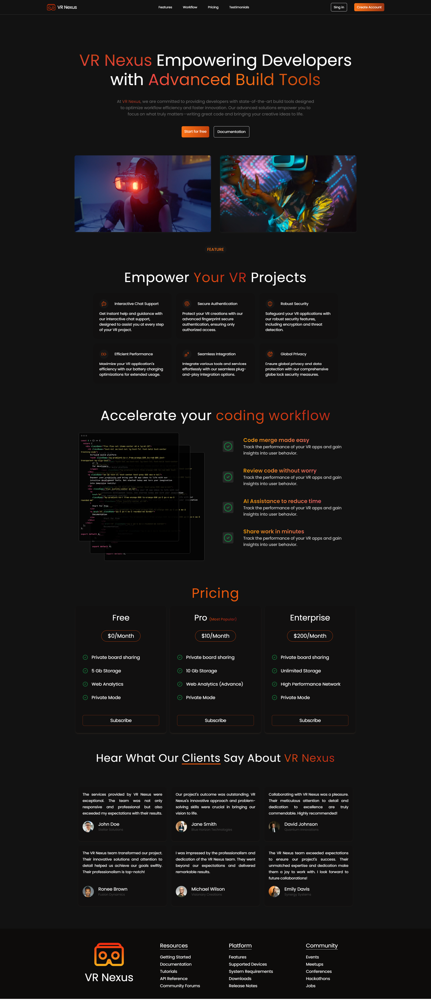

# VR Nexus

Welcome to VR Nexus, a project designed to learn and practice front-end development with React and Tailwind CSS. This website features interactive elements, including a testimonial section to showcase what our clients say about us.

## Features

- **Responsive Design**: The website is fully responsive, ensuring a seamless experience across all devices.
- **Testimonials**: Showcases client feedback to build trust and credibility.
- **Pricing Options**: Various plans to cater to different user needs.
- **Interactive UI**: User-friendly and engaging interface.

## Screenshots

Here is a screenshot of the project:

## Live Demo

Check out the live demo: [Live Demo](https://vr-nexus.vercel.app/)